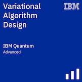
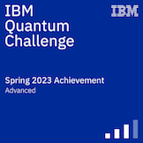
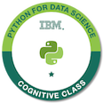

<h1 align="center">Backend & Quantum developer & dotQ-research executive</h1>

---
 
<h5 align='center'><i>"Since I was a child, I always want to be an "inventor" as my profession in the future. The ability to create new things from scratch always fascinates me. Now, I know that the nearest thing to a inventor this days is being a reseacher"</i></h5>
 
---

&nbsp;
&nbsp;
&nbsp;
&nbsp;
&nbsp;
&nbsp;
&nbsp;

&nbsp;
&nbsp;
&nbsp;

---

---
### Certifications & Challenges

 &nbsp;
&nbsp;
&nbsp;
&nbsp;

## Contact with me!
 

